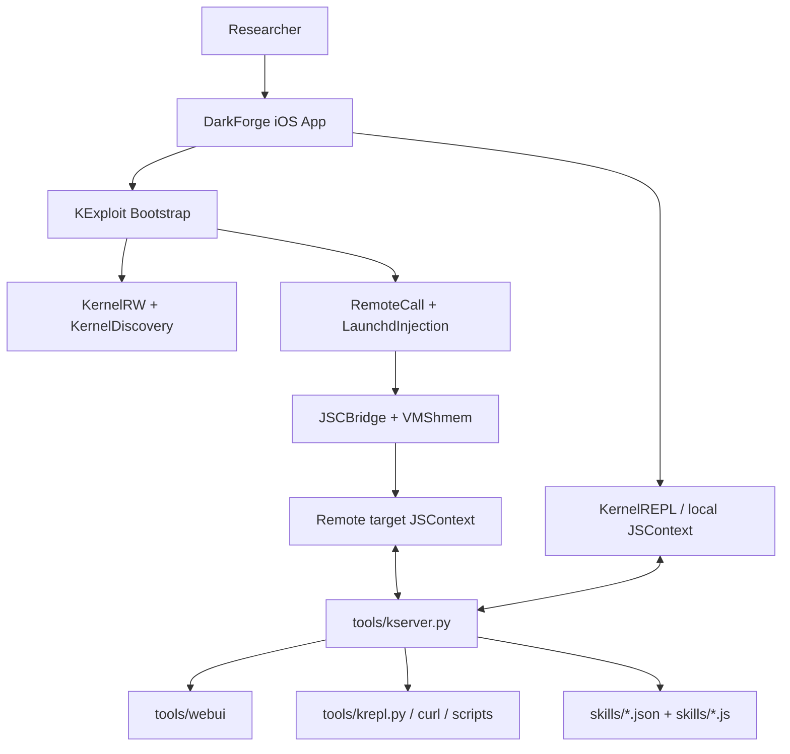

# Architecture

This document explains how DarkForge is structured and how code, transport, and
execution move between the iOS app, the privileged runtime, and the host tools.

## Design Summary

DarkForge has three major layers:

1. the iOS app that bootstraps the chain and owns the user-facing UI
2. the on-device JavaScript runtimes used for local and privileged execution
3. the host-side server and browser tooling used to control the device runtime

The project is powered by the DarkSword chain, but DarkForge adds a platform
layer on top of it: UI, host transport, bridge lifecycle, file workflows, and
skills.

## High-Level Component Graph



## Runtime Layers

### 1. App Layer

The app is the native shell that the researcher interacts with.

Primary files:

- `DarkForge/App/SceneDelegate.swift`
- `DarkForge/App/ViewController.swift`
- `DarkForge/App/FileManagerViewController.swift`
- `DarkForge/App/SkillsViewController.swift`
- `DarkForge/App/ConfigurationsViewController.swift`

Responsibilities:

- launch the bootstrap flow
- show runtime status
- expose filesystem and skill surfaces when the runtime is ready
- let the user configure the host address
- suspend or resume transport as the scene changes state

The app UI is intentionally thin. Most heavy lifting happens in the exploit,
bridge, and JS runtime layers.

### 2. Bootstrap / Chain Layer

The bootstrap layer is centered on `KExploit` and its helpers.

Primary files:

- `DarkForge/Exploit/KExploit.swift`
- `DarkForge/Exploit/SocketSpray.swift`
- `DarkForge/Exploit/RaceCondition.swift`
- `DarkForge/Exploit/PCBCorruption.swift`
- `DarkForge/Exploit/KernelRW.swift`
- `DarkForge/Exploit/KernelDiscovery.swift`
- `DarkForge/Exploit/LaunchdInjection.swift`
- `DarkForge/Exploit/RemoteCall.swift`
- `DarkForge/Exploit/PACUtils.swift`
- `DarkForge/Exploit/DeviceProfile.swift`

Responsibilities:

- establish early kernel read/write
- discover kernel base and device-specific layout
- forge or recover the objects needed for privileged control
- set up exception-based remote call paths
- bootstrap the remote JavaScript bridge

This layer is the most build-sensitive part of the system.

### 3. Local JS Runtime

`KernelREPL.swift` exposes an on-device JavaScriptCore environment and connects
back to the host with a WebSocket client.

Primary files:

- `DarkForge/Exploit/KernelREPL.swift`
- `DarkForge/Exploit/JSContextRegistration.swift`
- `DarkForge/Exploit/JSLibrary.swift`

Responsibilities:

- host the local JSContext
- register native Swift-backed helpers such as `kread64`, `kwrite64`, `rcall`,
  address math helpers, and userspace memory helpers
- load the shared JS helper library
- send results and logs back to the host

This runtime is the foundation for both ad hoc REPL work and parts of the skill
system.

### 4. Privileged Remote JS Runtime

`JSCBridge.swift` builds and controls a second JavaScript execution environment
inside the target privileged process.

Primary files:

- `DarkForge/Exploit/JSCBridge.swift`
- `DarkForge/Exploit/JSLibrary.swift`
- `DarkForge/Exploit/VMShmem.swift`

Responsibilities:

- allocate and share staging buffers between native and JS
- install the remote loader script
- expose higher-level objects such as `RootFS`, `Apps`, `Tasks`,
  `TaskMemory`, `MachO`, and `Staging`
- support larger payloads and richer workflows than simple raw RPC calls

This is the execution surface most skills care about.

## Bootstrap Flow

At a high level, runtime startup works like this:

1. The app triggers `KExploit.run()`.
2. The bootstrap code establishes kernel read/write and discovers the kernel
   base and offsets for the current environment.
3. DarkForge sets up the remote-call path used to run functions in the target
   privileged context.
4. `JSCBridge` installs a remote JavaScript environment in that context.
5. `KernelREPL` connects back to the host and exposes the local transport.
6. Once the bridge is ready, the Files and Skills surfaces become available.

Read [`CHAIN.md`](./CHAIN.md) for the current chain state and verification notes.

## Host Tooling

The host-side control plane is `tools/kserver.py`.

Responsibilities:

- accept the device WebSocket connection
- expose HTTP endpoints for REPL execution, remote calls, filesystem workflows,
  job state, and skill management
- serve the browser UI from `tools/webui/`
- normalize and run skills
- decide whether to use the app WebSocket runtime or the persistent agent path

Important files:

- `tools/kserver.py`
- `tools/krepl.py`
- `tools/webui/index.html`
- `tools/webui/app.js`
- `tools/webui/src/*.js`
- `tools/webui/styles.css`

Important endpoints:

- `POST /exec` or `POST /api/exec`
- `POST /rcall`
- `GET /api/skills`
- `POST /api/skills`
- `POST /api/skills/run`
- `POST /api/fs`
- `POST /api/fs/download`
- `GET /api/apps`

## Shared JS Library

`JSLibrary.swift` is the single source of truth for embedded JavaScript loaded
into both the local and remote runtimes.

It provides:

- low-level `Native` call and memory helpers
- filesystem helpers via `RootFS` and `FileUtils`
- process and app discovery via `Apps` and `Tasks`
- remote task memory access via `TaskMemory`
- Mach-O inspection and staging helpers
- host bridge shims such as `Host.acquireTaskPort`

That shared library is one of the core architectural choices in DarkForge:
high-level workflows stay in JavaScript, while the native side focuses on
bootstrap, transport, and primitives.

## Skill Execution Pipeline

Skills are defined by `skills/*.json` manifests and optional `.js` entry files.

Execution path:

1. The app or host requests a skill run.
2. `kserver.py` loads and normalizes the skill manifest.
3. Inputs are validated and coerced.
4. The server wraps the skill with:

```js
globalThis.skillInput = Object.freeze(...)
globalThis.SkillInput = globalThis.skillInput
```

5. The wrapped code is executed either:
   - interactively, returning a result directly
   - as a queued job, returning a `jobId`
6. Logs and results flow back through the host transport and UI.

Current constraints:

- only the `jscbridge` runtime is supported
- supported input types are `text`, `boolean`, `select`, and `app`
- entry files must remain inside the `skills/` directory

See [`docs/creating-skills.md`](./docs/creating-skills.md) for the authoring
guide.

## Trust Boundaries And Execution Contexts

DarkForge deliberately separates multiple execution contexts:

- native app process
- local JSContext inside the app
- remote privileged JSContext
- host-side Python server
- browser UI / CLI clients

That separation matters because the same API name can imply different power and
different failure modes depending on where it runs.

Examples:

- `/exec` is not the same as `/rcall`
- local userspace memory helpers are not the same as remote task memory helpers
- skills depend on the runtime being connected and ready

When documenting or extending the system, always specify:

- where the code runs
- what transport it uses
- what privileges it assumes
- what resources it can safely access

## Filesystem And UI Gating

The app intentionally hides some surfaces until the bridge is live.

Behavior:

- before bootstrap succeeds, the app exposes the bootstrap screen and settings
- once `KExploit.activeREPL?.jscBridge` is ready, the Files and Skills tabs are
  enabled

This protects users from interacting with flows that depend on unavailable
runtime capabilities.

## Failure Modes To Expect

Because DarkForge sits on top of exploit/bootstrap machinery, common failures
are not ordinary application bugs.

Examples:

- device/build-specific offset drift
- transport disconnection between app and host
- privileged bridge setup failing after the initial bootstrap
- skill runs that assume unavailable APIs or missing runtime state
- signing or build architecture mismatches on the host

Good architecture work in this repository usually means making those boundaries
and failure modes more explicit, not hiding them.

## Where To Go Deeper

- [`README.md`](./README.md) for onboarding and project framing
- [`CHAIN.md`](./CHAIN.md) for current chain status
- [`using-repl.md`](./using-repl.md) for REPL and host API examples
- [`docs/jsc-bridge-development-guide.md`](./docs/jsc-bridge-development-guide.md)
  for remote-JS bridge invariants and pitfalls
