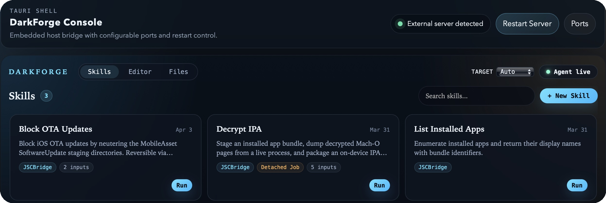

<p align="center">
  
</p>

<h1 align="center">DarkForge</h1>

<p align="center">
  iOS JavaScript runtime and skill platform for authorized on-device security research
</p>

<p align="center">
  
</p>

DarkForge is an iOS-first JavaScript runtime and skill platform for authorized
security research on owned, controlled, or explicitly permitted devices.

It is powered by the DarkSword chain, but the project itself is not a single
throwaway PoC. The goal is to turn a successful bootstrap into a reusable
environment for:

- kernel and process introspection
- launchd-context remote function calls
- root-capable filesystem workflows
- reusable JavaScript automation
- shareable "skills" that package common workflows

## Scope And Safety

DarkForge is intended for research and development on devices you own or are
explicitly authorized to test.

- Do not use it on third-party devices or infrastructure without permission.
- Expect sharp edges. This is a research platform, not a consumer product.
- Kernel offsets, process layouts, and bridge behavior are build-specific.

## What DarkForge Provides

- An iOS app that bootstraps the chain and surfaces the runtime in a native UI.
- A JavaScript REPL that can execute code on-device and talk to a Mac host.
- A higher-level JS environment with helpers such as `Apps`, `Tasks`,
  `TaskMemory`, `RootFS`, `MachO`, `Staging`, `FileUtils`, and lower-level
  `kread` / `kwrite` style primitives.
- A remote-call bridge for running functions in a privileged target context.
- A host-side server and browser UI for REPL, jobs, uploads, filesystem actions,
  and skill execution.
- A skill system that lets users define reusable JSON-described workflows backed
  by JavaScript entry files.

## Current Status

DarkForge is actively evolving and should be treated as research-grade software.
The repository currently includes:

- the iOS app under `DarkForge/`
- the generated Xcode project under `DarkForge.xcodeproj/`
- host tooling under `tools/`
- reference scripts under `scripts/`
- built-in skills under `skills/`
- investigation notes and chain documentation in the repository root

Known characteristics:

- The runtime is gated on a successful bootstrap. Until that succeeds, only the
  bootstrap screen and settings are available in the app.
- The pointer-auth path is arm64e-sensitive.
- Skills currently use the `jscbridge` runtime.

## Compatibility And Tested Environment

DarkForge should support iOS/iPadOS `18.3` and possibly slightly earlier 18.x
builds through `26.0.1`, provided the required device/build-specific offsets are
available and verified.

The current workspace is configured around:

- iPad Pro 2nd Gen A12X on iPadOS `18.3.2`
- iPhone 16 Plus on iOS `18.6`
- macOS `15.7.3`
- Xcode `16.2`
- Apple Development signing

Treat those as the currently tested environments, not the full compatibility
boundary. Other devices and builds can usually be supported with help from
users who contribute and validate the offsets needed for their targets.

## Installing

If you want to run DarkForge instead of developing it, use the latest release
artifacts first. Build from source when you want a local development build or
need to reproduce the release packages yourself.

### Option 1. Install The Latest Release

1. Download the latest desktop UI `.dmg` and iOS `.ipa` from
   [GitHub Releases](https://github.com/felipejfc/DarkForge/releases/latest).
   Current release assets are published as:
   - `DarkForge-<tag>-macos-arm64.dmg`
   - `DarkForge-<tag>-unsigned.ipa`
2. Open the `.dmg`, drag `DarkForge.app` into `/Applications`, and launch it on
   your Mac.
   If macOS blocks the first launch because the developer cannot be verified,
   open the app once, then go to System Settings -> Privacy & Security and use
   `Open Anyway` for `DarkForge`.
3. Open Sideloadly, choose the downloaded `DarkForge-<tag>-unsigned.ipa`, sign
   it with your Apple ID or development certificate, and install it on the
   target iPhone or iPad.
4. When Sideloadly finishes, open `DarkForge` on the device.

### Option 2. Build From Source

If you prefer to build both components yourself:

- clone the repo and follow the Quick Start below for prerequisites, signing,
  and host setup
- build the macOS desktop UI with `make desktop-build`, then use
  `make desktop-run` or `make desktop-install`
- build the iOS app with `make ios-build` or the `xcodebuild` flow in
  [`docs/BUILD-AND-DEPLOY.md`](./docs/BUILD-AND-DEPLOY.md)
- if you specifically want a Sideloadly-style `.ipa` from source, follow the
  packaging flow documented in
  [`docs/GITHUB-RELEASES.md`](./docs/GITHUB-RELEASES.md) or mirror
  [`.github/workflows/release.yml`](./.github/workflows/release.yml)

## Repository Layout

```text
DarkForge/                 iOS app, exploit/bootstrap code, JS bridge, UI
DarkForge.xcodeproj/       Generated Xcode project
tools/                     Host server, CLI helpers, browser UI
skills/                    Built-in skill manifests and JS entry files
scripts/                   Ad hoc research and validation scripts
docs/                      Focused implementation guides
CHAIN.md                   Current chain state and verified stages
docs/BUILD-AND-DEPLOY.md   Device build/deploy notes
docs/USING-REPL.md         REPL and HTTP API usage
docs/ARCHITECTURE.md       System design and execution model
```

## Quick Start

### 1. Prerequisites

- macOS with Xcode installed
- `xcodegen`
- an authorized iOS test device
- a signing setup that can build the chosen bundle ID

> **Note:** If you installed the desktop app (Option 1 or `make desktop-build`),
> the host server is bundled inside it and you do **not** need Python or any
> extra dependencies. The Python prerequisites below are only required if you
> want to run the standalone host server manually.
>
> <details><summary>Standalone server dependencies (optional)</summary>
>
> - Python 3
> - `websockets`:
>
> ```bash
> pip3 install websockets
> ```
>
> </details>

### 2. Configure Local Signing

The repo keeps generic defaults in [`Config/Project.xcconfig`](./Config/Project.xcconfig).
For signed local builds, copy the example and set your own team and bundle ID:

```bash
cp Config/Project.local.xcconfig.example Config/Project.local.xcconfig
```

`Config/Project.local.xcconfig` is gitignored, so your local values stay out of
the open-source repo.

### 3. Generate Or Refresh The Xcode Project

```bash
xcodegen generate
```

### 4. Build

For unsigned verification builds, the project currently needs an arm64e build:

```bash
xcodebuild -project DarkForge.xcodeproj -scheme DarkForge \
  -configuration Debug \
  -destination 'generic/platform=iOS' \
  ARCHS=arm64e \
  CODE_SIGNING_ALLOWED=NO CODE_SIGNING_REQUIRED=NO \
  build
```

For normal signed device builds and deployment notes, see
[`docs/BUILD-AND-DEPLOY.md`](./docs/BUILD-AND-DEPLOY.md).

### 5. Start The Host Server

If you are using the **desktop app** (recommended), simply launch it — the host
server starts automatically and no extra setup is needed. Skip to step 6.

If you prefer to run the standalone Python server instead:

```bash
python3 tools/kserver.py
```

Either way, the host process provides:

- WebSocket transport on `9090`
- HTTP API on `9092`
- a browser UI served by the same host tooling

### 6. Launch The App And Bootstrap The Runtime

In the app:

1. configure the host address in Settings
2. use the bootstrap screen to start the runtime
3. wait for the runtime to become ready
4. use the Files and Skills tabs once the bridge is active

## Main Workflows

### REPL And Host API

Use the host server for:

- `/exec` to run JS in the app-connected environment
- `/rcall` to invoke functions in the remote privileged context
- `/api/skills/run` to execute reusable skills
- `/api/fs` and `/api/fs/download` for filesystem workflows

The detailed request shapes and examples are in
[`docs/USING-REPL.md`](./docs/USING-REPL.md).

### Skills

Skills are reusable JavaScript workflows described by `skills/*.json` manifests.
They can be:

- browsed and executed from the native app
- managed through the host API
- run interactively or queued as jobs

To create a shared repo, see [`docs/REPO.md`](./docs/REPO.md).
To add a new skill, see [`docs/CREATING-SKILLS.md`](./docs/CREATING-SKILLS.md).

## Important Documents

- [`docs/ARCHITECTURE.md`](./docs/ARCHITECTURE.md): system structure, execution model,
  data flow, and trust boundaries
- [`docs/BUILD-AND-DEPLOY.md`](./docs/BUILD-AND-DEPLOY.md): build and install
  workflow
- [`docs/USING-REPL.md`](./docs/USING-REPL.md): REPL usage and HTTP API examples
- [`docs/JSC-BRIDGE-DEVELOPMENT-GUIDE.md`](./docs/JSC-BRIDGE-DEVELOPMENT-GUIDE.md):
  bridge-specific pitfalls and invariants
- [`docs/REPO.md`](./docs/REPO.md): repo structure for shared skills and libraries
- [`docs/CREATING-SKILLS.md`](./docs/CREATING-SKILLS.md): skill authoring guide

## Design Goals

DarkForge is optimized for iteration speed after bootstrap:

- keep research workflows in JavaScript instead of rebuilding native code
- expose a stable-enough host transport for repeatable experiments
- let users package repeatable workflows as skills
- preserve room for both low-level primitives and higher-level automations

## Non-Goals

DarkForge is not trying to be:

- a polished end-user jailbreak distribution
- a compatibility layer for every iOS build and device class
- a replacement for careful device-specific investigation

## Known Issues

- Sometimes the device panics and restarts if the DarkForge app is closed, even
  after Agent injection.
- Sometimes the exploit fails to execute and can crash the phone. If that
  happens, simply force reboot and try again.
- Some random crashes when running JS code that need further investigation.

## Contributing

Contributions are most useful when they improve one of these areas:

- runtime stability
- bridge reliability
- device/build portability
- skills and higher-level tooling
- documentation and reproducibility

If you add functionality, prefer documenting:

- the device/build assumptions
- the expected runtime context
- how to verify the result
- any new risks or offsets that future maintainers need to know
